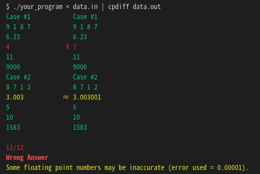

# cpdiff

Install using (globally since it's a CLI application):

```bash
npm install -g cpdiff
```

Compare your program's output to the accepted answer:

```bash
./your_program < data.in | cpdiff data.out
```

<p align="center">
  
</p>

## About

This is a simple utility for comparing the output of your program to the accepted answer or sample output. The name stands for *competitive programming difference*.

This program was developed because programs like `sdiff` or `diff` completely deform the layout when there are too many differences. This tool is meant to be specific for competitive programming.

## Usage

Compare two files:

```bash
cpdiff file1 file2
```

Specify only one file, but pass the output of some other program as input (stdin).

```bash
some_program | cpdiff file1
```

Use `-` (dash) to specify which side of the comparison should receive input from stdin.

```bash
cpdiff - file1
# or
cpdiff file1 -
```

## More competitive programming tools

Try my [C++ runner](https://gist.github.com/ChrisVilches/5f251851e93e45bc9941aa94ec13973d). I use this program to quickly run C++ files as if they were scripts, using the simple `c++ my_program.cpp` command.

## Contribution

Feature requests, issues, bug reports, pull requests are welcome.
